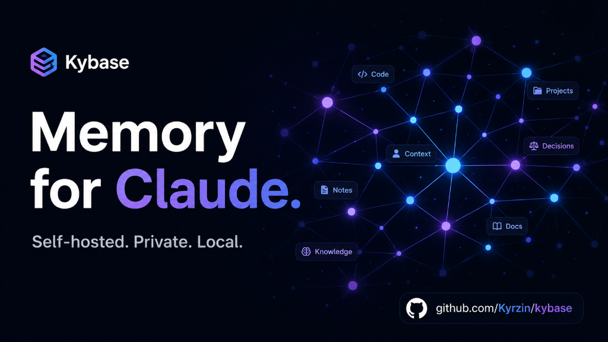

<p align="center">
  
</p>

<h1 align="center">Kybase</h1>

<p align="center">
  <strong>A personal, self-hosted knowledge base that your AI agent uses as native, persistent memory.</strong>
</p>

---

Kybase is a complete, self-contained Markdown notes application and MCP (Model Context Protocol) server.

* **For You:** A sleek web-based notes editor with wikilinks `[[Title]]`, an interactive visual knowledge graph, backlinks, and bilingual hybrid search.
* **For Claude (Claude Code / Desktop):** A persistent memory vault that survives across chats, automatically growing and linking notes as you work.

Everything runs locally on your machine via Docker: PostgreSQL for notes, pgvector + Ollama for embeddings. **No SaaS, no accounts, 100% private.**

## Why Kybase?

Giving an agent persistent memory usually means assembling it yourself:
a notes app, an MCP bridge, an embedding pipeline, and sync between them.
Kybase is that whole stack as one `docker compose up`:

- **MCP-native** — 13 tools (`search_notes`, `get_note_with_links`, `get_graph`, `get_backlinks`, CRUD for notes/folders) over Streamable HTTP, with instructions that teach the agent to interlink notes properly
- **Local semantic search** — pgvector + Ollama embeddings, private by default; hybrid RRF fusion with bilingual full-text search
- **Agent-friendly graph** — explicit wikilink edges plus *semantic edges* computed from embedding similarity, so the agent discovers related notes that were never linked
- **Zero external services** — app, Postgres+pgvector, and Ollama in one compose file; single-secret auth

## Features

- **Markdown notes with wikilinks** — `[[Title]]` links between notes, backlinks panel; renaming a note rewrites its wikilinks everywhere
- **Graph view** — link edges plus semantic edges with a similarity slider
- **Hybrid search** — RRF fusion of pgvector cosine similarity and bilingual FTS, chunked embeddings, excerpt-based results
- **Workspace focus mode** — filter tree, graph, and search down to one top-level folder
- **Pluggable embeddings** — Ollama (local, default), Google, or OpenAI, all 768-dim, switchable without schema changes

---

## Stack

| Layer | Tech |
|-------|------|
| Frontend | Next.js App Router, React 19 |
| Database | PostgreSQL 16 + pgvector (direct `pg` connection) |
| Embeddings | Ollama `nomic-embed-text` (default) / Google / OpenAI |
| Search | RRF hybrid: pgvector HNSW cosine + bilingual FTS |
| MCP | `@modelcontextprotocol/sdk` Streamable HTTP |
| Auth | Single `KYBASE_SECRET` env var |

---

## Quick Start (Docker)

```bash
git clone https://github.com/Kyrzin/kybase.git
cd kybase
cp .env.example .env
# edit .env: set KYBASE_SECRET (openssl rand -hex 32)
docker compose up -d --build
```

Open http://localhost:3000 and log in with your `KYBASE_SECRET`.

That's it. On first start Postgres applies `db/migrations/*.sql`
automatically and Ollama downloads the embedding model (~270 MB, one time).
Change the host port with `KYBASE_PORT` in `.env`.

> **Note on embeddings:** notes and text search work immediately. Semantic
> search and semantic graph edges activate once Ollama finishes pulling the
> model and notes get indexed (automatic, in the background).

## Connect Claude (MCP)

The app exposes a Streamable HTTP MCP endpoint at `/api/mcp`.

**Claude Code** — add to `.mcp.json` (or `claude mcp add`):

```json
{
  "mcpServers": {
    "kybase": {
      "type": "http",
      "url": "https://your-domain/api/mcp",
      "headers": {
        "Authorization": "Bearer <KYBASE_SECRET>"
      }
    }
  }
}
```

**claude.ai** — Settings → Connectors → Add custom connector, same URL
(requires the instance to be reachable over HTTPS).

Available tools: `list_notes`, `get_note`, `get_note_with_links`,
`create_note`, `update_note`, `delete_note`, `search_notes`, `list_folders`,
`create_folder`, `update_folder`, `delete_folder`, `get_backlinks`, `get_graph`.

The server ships with MCP instructions that teach the agent to search before
writing and to add `[[wikilinks]]` to related notes — so the knowledge graph
grows as the agent uses it, instead of accumulating orphan notes.

---

## Local development

```bash
# Postgres only (app runs on the host)
docker compose up -d db
cp .env.example .env.local
# in .env.local: set KYBASE_SECRET and uncomment DATABASE_URL
npm install
npm run dev                  # http://localhost:3000
```

---

## Switching Embedding Providers

You can switch the embedding provider (between local Ollama, Google, or OpenAI) and trigger re-indexing directly in the browser:

1. Open the settings modal in the web UI.
2. Select your provider, add the API key if needed, and click **Save & Apply** (switching the provider automatically triggers background re-indexing).
3. Alternatively, click **Reindex** to force-reindex all your notes.

All supported providers use 768-dimensional embeddings, so switching does not require any database schema changes.

> **CLI Alternative:** If you prefer using the terminal, you can trigger re-indexing by calling the admin endpoint:
> ```bash
> docker compose exec kybase node -e "
>   fetch('http://localhost:3000/api/admin/reindex', {
>     method: 'POST',
>     headers: { Authorization: 'Bearer <KYBASE_SECRET>' }
>   }).then(r => r.json()).then(console.log)
> "
> ```

---

## Upgrading

`docker-entrypoint-initdb.d` migrations only run on a fresh database volume.
When an upgrade ships a new `db/migrations/NNN_*.sql`, apply it manually:

```bash
docker compose exec -T db psql -U kybase kybase < db/migrations/NNN_name.sql
```

---

## Development

```bash
npm test          # Vitest unit tests (wikilinks, embeddings, search/RRF)
npm run build     # Production build check
npx tsc --noEmit  # Type check
```

---

## License

[PolyForm Noncommercial 1.0.0](LICENSE.md) — free to use, modify, and share
for any **noncommercial** purpose. Commercial use requires a separate license
from the author.

Required Notice: Copyright © Denis Kurzin (https://github.com/Kyrzin)
