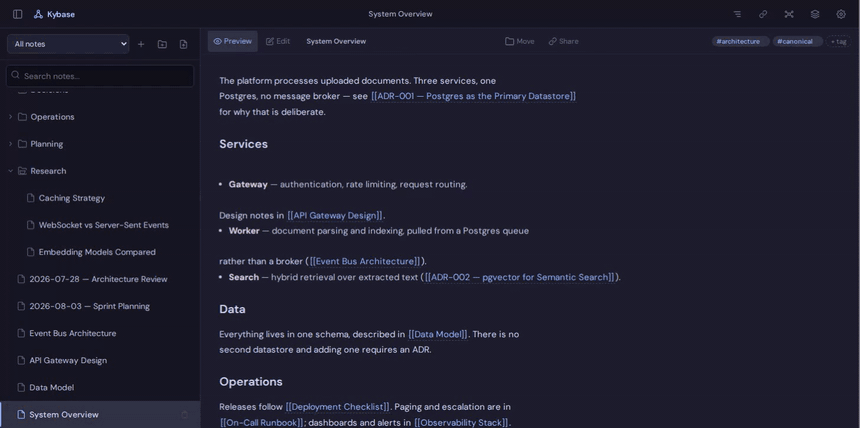

<p align="center">
  
</p>

<p align="center">
  <a href="https://github.com/Kyrzin/kybase/actions/workflows/ci.yml"></a>
  <a href="https://github.com/Kyrzin/kybase/releases"></a>
  <a href="https://glama.ai/mcp/servers/Kyrzin/kybase"></a>
  <a href="LICENSE"></a>
  
  
</p>

<h3 align="center">Your AI forgets when the session ends. Kybase remembers.</h3>

Kybase gives Claude, Cursor, Windsurf and any other MCP-speaking agent a
long-term memory you own: one Markdown knowledge base, running on your own
machine, that every agent can search, read and update — and that you can
open in a browser and edit by hand.

**Self-hosted. Private by default. Plain Markdown. Yours.**

<p align="center">
  
</p>

**[The problem](#the-problem) · [Quick start](#quick-start) · [Connect your agent](#connect-your-agent) · [What you get](#what-you-get) · [Settings](#settings) · [Sharing](#sharing-notes) · [Backups](#backups) · [Upgrading](#upgrading)**

## The problem

You tell your agent how the staging deploy works. It helps, and the
session ends.

Tomorrow you open a new one:

> **You:** what did we decide about the staging database?
>
> **Agent:** I don't have that context — could you tell me again?

So you explain it again. Then you switch editors, and explain it there too.

With Kybase, the knowledge lives outside the agent:

> **You:** what did we decide about the staging database?
>
> **Agent:** *(searches Kybase)* You moved staging to its own Postgres
> instance so migrations could be tested against real data first — that's
> in "Staging environment", under "Database".

New session, same memory. Different tool, same memory.

## Quick start

### One local agent

Nothing to install, no Docker, no database to run:

```json
{
  "mcpServers": {
    "kybase": {
      "command": "npx",
      "args": ["-y", "kybase-mcp"]
    }
  }
}
```

Put that in your client's MCP config and restart it. Your notes live under
`~/.kybase`, and `kybase-mcp export vault.zip` gets them back out as plain
Markdown at any time.

### The full app

For the web UI, the graph view, share links, and several agents against one
knowledge base:

**macOS and Linux**

```bash
git clone https://github.com/Kyrzin/kybase.git
cd kybase
cp .env.example .env
sed -i.bak "s/^KYBASE_SECRET=$/KYBASE_SECRET=$(openssl rand -hex 32)/" .env
sed -i.bak "s/^POSTGRES_PASSWORD=$/POSTGRES_PASSWORD=$(openssl rand -hex 16)/" .env
rm -f .env.bak
docker compose pull && docker compose up -d
```

**Windows (PowerShell)** — no `openssl` or `sed` there, so the secrets are
generated by .NET instead:

```powershell
git clone https://github.com/Kyrzin/kybase.git
cd kybase
Copy-Item .env.example .env
$rng = [System.Security.Cryptography.RandomNumberGenerator]::Create()
$b = New-Object byte[] 32; $rng.GetBytes($b)
$secret = ($b | ForEach-Object { $_.ToString('x2') }) -join ''
$b = New-Object byte[] 16; $rng.GetBytes($b)
$pass = ($b | ForEach-Object { $_.ToString('x2') }) -join ''
(Get-Content .env) -replace '^KYBASE_SECRET=$', "KYBASE_SECRET=$secret" -replace '^POSTGRES_PASSWORD=$', "POSTGRES_PASSWORD=$pass" | Set-Content .env
docker compose pull
docker compose up -d
```

Either block generates the only two secrets you need and starts the stack.
Open http://localhost:3000, log in with your `KYBASE_SECRET` — `grep
KYBASE_SECRET .env` shows it, or `Select-String KYBASE_SECRET .env` on
Windows — then [connect an agent](#connect-your-agent).

That installs the app and its database — around 1 GB. Notes and text search
work right away.

**Semantic search needs an embedding provider.** Open Settings and pick one:

- **Google or OpenAI** — paste an API key and you are done.
- **Ollama, on your own machine** — start it once, then pick a model in
  Settings:

  ```
  docker compose --profile ollama up -d
  ```

  It is not in the default install because its image carries NVIDIA and AMD
  GPU runtimes whatever your hardware is — about 4 GB that someone using a
  cloud provider would never run. Starting it later touches nothing else:
  the app keeps running and no note is affected.

## Connect your agent

Kybase speaks MCP over Streamable HTTP at `/api/mcp`, so any client that
speaks it can connect.

**Claude Code** — `.mcp.json` in your project (or `claude mcp add`):

```json
{
  "mcpServers": {
    "kybase": {
      "type": "http",
      "url": "https://your-domain/api/mcp",
      "headers": {
        "Authorization": "Bearer <KYBASE_SECRET>"
      }
    }
  }
}
```

That's it — the agent can now search your notes, read them, write new ones,
update existing ones and link them together.

<details>
<summary><b>Other clients</b> — Claude Desktop, claude.ai, Cursor, Windsurf</summary>

**Claude Desktop** — the same JSON shape, in `claude_desktop_config.json`
(macOS: `~/Library/Application Support/Claude/claude_desktop_config.json`,
Windows: `%APPDATA%\Claude\claude_desktop_config.json`).

**Cursor** — the same shape without `"type"`, in `.cursor/mcp.json`
(project) or `~/.cursor/mcp.json` (global).

**Windsurf** — `~/.codeium/windsurf/mcp_config.json`, with `serverUrl`
instead of `url`:

```json
{
  "mcpServers": {
    "kybase": {
      "serverUrl": "https://your-domain/api/mcp",
      "headers": {
        "Authorization": "Bearer <KYBASE_SECRET>"
      }
    }
  }
}
```

**claude.ai** — Settings → Connectors → Add custom connector, same URL
(the instance has to be reachable over HTTPS). No key to paste: the
connector registers itself, sends you to your own instance to enter the key
once, and gets its own revocable token — see **Settings → Connected
clients** in the web UI.

**Clients that only speak stdio** use the `npx -y kybase-mcp` block from
[Quick start](#one-local-agent), in the same file.

</details>

## What you get

- **Markdown, not an opaque memory blob** — every note is plain text; read
  it, edit it, `grep` it, back it up with `cp`
- **One knowledge base, every agent** — Claude, Cursor, Windsurf and the
  web UI all look at the same notes
- **Hybrid search** — full-text and meaning-based search fused into one
  ranked result, so an agent finds the note whether it knows the exact
  wording or not
- **Section-level reads and writes** — an agent reads or edits the part of
  a note it needs, not the whole file
- **Backlinks and a knowledge graph** — `[[wikilinks]]` connect related
  notes automatically
- **Yours to take** — Settings → **Export .zip** gives plain Markdown with
  folders as directories, readable by any editor, Obsidian included.
  **Import .zip** merges one back.

Obsidian and Notion are built for a person reading and writing. Kybase is
built for the loop between **you ↔ your knowledge ↔ your agent**: you edit
in the browser, an agent searches and updates over MCP, and both are looking
at the same Markdown. If the agent remembered something wrong, you open the
note and fix the sentence.

## Private by default

Kybase runs on your infrastructure. No SaaS account, no external memory
service, no cloud database — your own Postgres, local embeddings through
Ollama, and a secret you generate.

Cloud embedding providers are optional. Choosing one sends your notes' full
text to that provider to compute embeddings; Ollama keeps everything on your
machine.

## How agents use it

```text
search_notes("deployment steps for staging")
  → hit includes section: "Rollback"
  → get_note(section: "Rollback")
  → agent reads just that section, not the whole note
  → append_to_note(section: "Rollback", text: "...")
```

Search says which *section* of a note matched, not just which note. On a long
note that can mean reading a fraction of the content — cheaper for every step
after the first search, and it is how the agent writes back too.

The server ships with instructions that teach the agent to search before
writing and to add `[[wikilinks]]` to related notes, so the graph grows as
the agent works instead of filling up with orphans.

## Settings

Everything else goes in `.env`, copied from `.env.example`, which documents
each option. Only `KYBASE_SECRET` and `POSTGRES_PASSWORD` are required;
`KYBASE_PORT` changes the host port, and `KYBASE_TAG` pins a version (e.g.
`1.4`) instead of tracking `latest`.

**Embedding provider.** Open Settings in the web UI, pick a provider
(Ollama, Google or OpenAI), choose a model, add an API key if it needs one,
and click **Save & Apply**. Switching re-embeds every note, and the database
adapts to the new model's vector size on its own.

> [!IMPORTANT]
> Ollama keeps everything on your machine. Google and OpenAI are convenience
> options: picking either sends your notes' full text to that provider.

## Sharing notes

The **Share** button on a note creates a public read-only link — rendered
Markdown, no login, wikilinks shown as plain text so nothing else in your
vault is reachable. **The link is the access**: revoke links you no longer
need under Settings → Active share links.

## Backups

Everything lives in one Postgres volume, so a nightly `pg_dump` is one line.
Full recipe including cron and restore: [docs/backup.md](docs/backup.md).

## Upgrading

```bash
# prebuilt image
docker compose pull && docker compose up -d

# or rebuild from source
git pull && docker compose up -d --build
```

Migrations apply automatically on startup. Details:
[docs/upgrading.md](docs/upgrading.md).

## More documentation

[SECURITY.md](SECURITY.md) (threat model) ·
[CONTRIBUTING.md](CONTRIBUTING.md) (running it locally, opening a PR) ·
[docs/backup.md](docs/backup.md) · [docs/upgrading.md](docs/upgrading.md) ·
[packages/kybase-mcp](packages/kybase-mcp) (the standalone stdio package)

## License

[AGPL-3.0](LICENSE) — free to use, modify, and self-host. If you run a
modified version as a network service, you must make its source available
to your users under the same license.

For a commercial license (e.g. embedding Kybase in a closed-source product
or service), contact the author.

Copyright © Denis Kurzin (https://github.com/Kyrzin)
