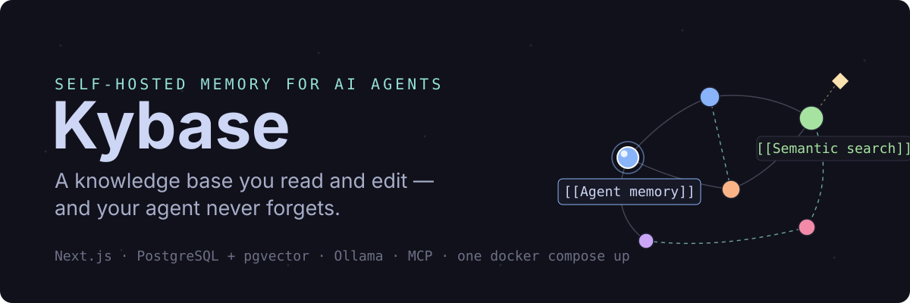
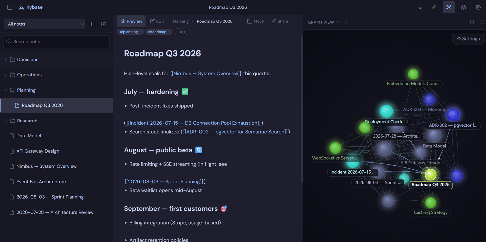

<p align="center">
  
</p>

<p align="center">
  <a href="https://github.com/Kyrzin/kybase/actions/workflows/ci.yml"></a>
  <a href="https://github.com/Kyrzin/kybase/releases"></a>
  <a href="LICENSE"></a>
  
  
</p>

Your AI agent forgets everything between sessions. Kybase fixes that: a
self-hosted Markdown knowledge base **you** browse and edit in the browser,
that **Claude** uses as persistent memory over MCP. The agent writes notes as
you work, links them with `[[wikilinks]]`, and finds them again next session —
no re-onboarding, no lost decisions.

Everything runs on your machine via Docker: PostgreSQL for notes,
pgvector + Ollama for embeddings. **No SaaS, no accounts, private by default**
(see [Switching Embedding Providers](#switching-embedding-providers) for the
trade-off if you opt into a cloud embedding provider).

<p align="center">
  
</p>

## Why Kybase?

Giving an agent persistent memory usually means assembling it yourself:
a notes app, an MCP bridge, an embedding pipeline, and sync between them.
Kybase is that whole stack as one `docker compose up`:

- **MCP-native** — 17 tools (`search_notes`, `get_note_with_links`, `get_graph`, `get_backlinks`, `append_to_note`, `indexing_status`, CRUD for notes/folders) over Streamable HTTP, with instructions that teach the agent to interlink notes properly
- **Local semantic search** — pgvector + Ollama embeddings, private by default; hybrid RRF fusion with bilingual full-text search and chunked, excerpt-based results
- **Agent-friendly graph** — explicit wikilink edges plus *semantic edges* computed from embedding similarity, so the agent discovers related notes that were never linked
- **A real notes app, not a black box** — web editor with backlinks, graph view with a similarity slider, workspace focus mode; renaming a note rewrites its wikilinks everywhere
- **Zero external services** — app, Postgres+pgvector, and Ollama in one compose file; single-secret auth, revocable per-client OAuth tokens for MCP

## Quick Start (Docker)

```bash
git clone https://github.com/Kyrzin/kybase.git
cd kybase
cp .env.example .env
# edit .env: set KYBASE_SECRET (openssl rand -hex 32)
docker compose pull && docker compose up -d
```

This pulls the prebuilt multi-arch image
([`ghcr.io/kyrzin/kybase`](https://github.com/Kyrzin/kybase/pkgs/container/kybase),
linux/amd64 + linux/arm64) from GitHub Packages, tagged `latest`. To build from
source instead, run `docker compose up -d --build`.

Open http://localhost:3000 and log in with your `KYBASE_SECRET`.

That's it. On startup the app applies `db/migrations/*.sql` automatically
(tracked in the `schema_migrations` table) and Ollama downloads the
embedding model (embeddinggemma, ~620 MB, one time).
Change the host port with `KYBASE_PORT` in `.env`.

> **Note on embeddings:** notes and text search work immediately. Semantic
> search and semantic graph edges activate once Ollama finishes pulling the
> model and notes get indexed (automatic, in the background).

## Connect Claude (MCP)

The app exposes a Streamable HTTP MCP endpoint at `/api/mcp`.

**Claude Code** — add to `.mcp.json` (or `claude mcp add`):

```json
{
  "mcpServers": {
    "kybase": {
      "type": "http",
      "url": "https://your-domain/api/mcp",
      "headers": {
        "Authorization": "Bearer <KYBASE_SECRET>"
      }
    }
  }
}
```

**claude.ai** — Settings → Connectors → Add custom connector, same URL
(requires the instance to be reachable over HTTPS). Each client gets its own
revocable OAuth token — see **Settings → Connected clients** in the web UI.

Available tools: `list_notes`, `get_note`, `get_note_with_links`,
`create_note`, `update_note`, `append_to_note`, `delete_note`, `restore_note`,
`search_notes`, `indexing_status`, `list_tags`, `list_folders`, `create_folder`,
`update_folder`, `delete_folder`, `get_backlinks`, `get_graph`.

The server ships with MCP instructions that teach the agent to search before
writing and to add `[[wikilinks]]` to related notes — so the knowledge graph
grows as the agent uses it, instead of accumulating orphan notes.

## Stack

| Layer | Tech |
|-------|------|
| Frontend | Next.js App Router, React 19 |
| Database | PostgreSQL 16 + pgvector (direct `pg` connection) |
| Embeddings | Ollama `embeddinggemma` (default, multilingual) / Google / OpenAI |
| Search | RRF hybrid: pgvector HNSW cosine + bilingual FTS |
| MCP | `@modelcontextprotocol/sdk` Streamable HTTP |
| Auth | `KYBASE_SECRET` env var + revocable per-client OAuth tokens (MCP) |

---

## Switching Embedding Providers

You can switch the embedding provider (between local Ollama, Google, or OpenAI) and trigger re-indexing directly in the browser:

1. Open the settings modal in the web UI.
2. Select your provider, add the API key if needed, and click **Save & Apply** (switching the provider automatically re-indexes every note).
3. **Reindex** only catches notes that were never embedded. After anything else that changes how embeddings are computed (e.g. an update to the embedding logic itself), use **Reindex all** to force-recompute every note.

All supported providers use 768-dimensional embeddings, so switching does not require any database schema changes.

> **Privacy trade-off:** Ollama keeps everything on your machine — no note
> content leaves it. Google and OpenAI are convenience options: picking either
> sends your notes' full text to that provider's API to compute the embedding.

**Local model choice.** The default local model is `embeddinggemma` (Google,
multilingual) — for multilingual vaults (e.g. Russian/German) set the Ollama
model to `embeddinggemma`; it separates relevant from irrelevant notes far
better than English-centric models. `nomic-embed-text` is a smaller,
English-leaning alternative. The semantic-similarity threshold adapts to the
model automatically (see `getMinSimilarity` in `lib/embeddings.ts`), so no
manual tuning is needed when you switch.

**Already run Ollama?** On a host that already has an Ollama instance (e.g. a
GPU one), skip the bundled CPU container: set `OLLAMA_URL` in `.env` to your
instance (pull `OLLAMA_MODEL` there first) and start with the override file —
`docker compose -f docker-compose.yml -f docker-compose.external-ollama.yml up -d`.

> **CLI Alternative:** If you prefer using the terminal, you can trigger re-indexing by calling the admin endpoint — only pending notes by default, add `?mode=all` to the URL to force every note instead:
> ```bash
> docker compose exec kybase node -e "
>   fetch('http://localhost:3000/api/admin/reindex', {
>     method: 'POST',
>     headers: { Authorization: 'Bearer <KYBASE_SECRET>' }
>   }).then(r => r.json()).then(console.log)
> "
> ```

---

## Export & Import

Your notes are never locked in. Settings → **Export .zip** downloads the
whole vault as plain markdown files with frontmatter (title, tags, dates),
folders as directories — readable by any editor, Obsidian included.
**Import .zip** merges a vault back; notes whose titles already exist are
skipped. Imported notes are re-embedded automatically in the background.

The same via API:

```bash
curl -H "Authorization: Bearer <KYBASE_SECRET>" -o vault.zip \
  http://localhost:3000/api/export

# mode=skip (default) keeps existing notes; mode=overwrite replaces them
curl -X POST -H "Authorization: Bearer <KYBASE_SECRET>" \
  --data-binary @vault.zip \
  "http://localhost:3000/api/import?mode=skip"
```

---

## Sharing notes

The **Share** button on a note creates a public read-only link
(`/share/<token>`) — rendered markdown, no login, wikilinks shown as plain
text so nothing else in your vault is reachable. The threat model in one
sentence: **the link is the access — revoke links you no longer need**
(Settings → Active share links shows everything that is currently public).

---

## Backups

Everything lives in one Postgres volume — a nightly `pg_dump` is one line.
Full recipe including cron and restore: [docs/backup.md](docs/backup.md).

---

## Upgrading

```bash
# prebuilt image
docker compose pull && docker compose up -d

# or rebuild from source
git pull && docker compose up -d --build
```

Migrations apply automatically on startup. Details: [docs/upgrading.md](docs/upgrading.md).

---

## Local development

```bash
# Postgres only (app runs on the host)
docker compose up -d db
cp .env.example .env.local
# in .env.local: set KYBASE_SECRET and uncomment DATABASE_URL
npm install
npm run dev                  # http://localhost:3000

npm test          # Vitest unit tests
npm run build     # Production build check
npx tsc --noEmit  # Type check
```

---

## License

[AGPL-3.0](LICENSE) — free to use, modify, and self-host. If you run a
modified version as a network service, you must make its source available
to your users under the same license.

For a commercial license (e.g. embedding Kybase in a closed-source product
or service), contact the author.

Copyright © Denis Kurzin (https://github.com/Kyrzin)
